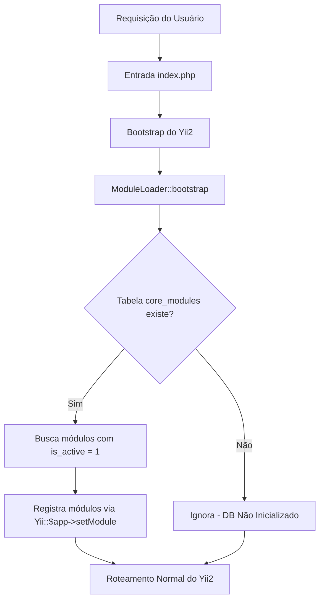
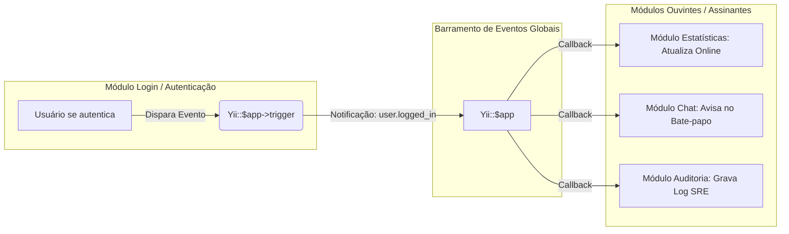

# 🏛️ Arquitetura e Inicialização Dinâmica

Para garantir que o Portal Crom seja verdadeiramente extensível de forma incremental, seu núcleo foi projetado em torno de duas abstrações fundamentais: **Bootstrap Dinâmico** (carregamento sob demanda) e **Barramento de Eventos Globais** (comunicação desacoplada).

---

## 🔌 Bootstrap Dinâmico (`ModuleLoader`)

Em um monólito modular clássico, todos os módulos precisam ser declarados estaticamente nos arquivos de configuração do framework (ex: `config/web.php`). No entanto, para que novos aplicativos possam ser ativados, desativados ou instalados pelos administradores sem mexer em arquivos de código, o Portal Crom utiliza o componente personalizado **ModuleLoader**.

Este componente implementa a interface `yii\base\BootstrapInterface` do Yii2, injetando os módulos ativos na configuração do aplicativo em tempo de execução, logo no início do ciclo de vida da requisição.



### Código do Componente (`components/ModuleLoader.php`):
```php
namespace app\components;

use yii\base\BootstrapInterface;

class ModuleLoader implements BootstrapInterface
{
    public function bootstrap($app)
    {
        try {
            $db = $app->db;
            // Evita falhar a inicialização em comandos CLI ou antes das migrações
            $tableSchema = $db->getTableSchema('core_modules');
            if ($tableSchema !== null) {
                // Consulta os módulos ativos cadastrados no SQLite
                $command = $db->createCommand("SELECT id FROM core_modules WHERE is_active = 1");
                $modules = $command->queryColumn();
                
                foreach ($modules as $moduleId) {
                    $app->setModule($moduleId, [
                        'class' => "app\\modules\\{$moduleId}\\Module",
                    ]);
                }
            }
        } catch (\Exception $e) {
            // Silencia exceções para garantir a resiliência do sistema
        }
    }
}
```

---

## ⚡ Barramento de Eventos Globais (Desacoplamento Absoluto)

Se as partes do sistema não podem conhecer os detalhes internos umas das outras, como elas transmitem informações cruciais? A resposta está no **Barramento de Eventos Globais** provido nativamente pelo objeto `Yii::$app`.

Cada módulo funciona como um microsserviço isolado dentro do monólito. Interações globais são realizadas através de eventos nomeados e payloads estruturados.



### 1. Disparando um Evento Global
Quando o módulo de autenticação realiza o login de um membro, ele não chama as classes de estatísticas ou logs diretamente. Ele apenas comunica o fato para o barramento global:

```php
// No Módulo de Login (ou Core) ao autenticar com sucesso:
use app\events\UserEvent;

$event = new UserEvent([
    'userId' => $user->id,
    'username' => $user->username,
    'timestamp' => time()
]);

Yii::$app->trigger('user.logged_in', $event);
```

### 2. Registrando um Ouvinte (Listener)
Módulos interessados assinam o evento global durante o seu próprio processo de inicialização (`init()` do seu arquivo `Module.php` correspondente):

```php
namespace app\modules\stats;

use Yii;
use yii\base\Module as BaseModule;

class Module extends BaseModule
{
    public function init()
    {
        parent::init();

        // Registra o ouvinte no barramento global
        Yii::$app->on('user.logged_in', function($event) {
            // Ação: Grava a presença online do usuário logado no SQLite
            $db = Yii::$app->db;
            $db->createCommand("
                INSERT OR REPLACE INTO core_session_status (user_id, last_activity, is_online)
                VALUES (:userId, :time, 1)
            ", [
                ':userId' => $event->userId,
                ':time' => $event->timestamp
            ])->execute();
        });
    }
}
```

---

## 📈 Benefícios Técnicos Alcançados

1. **Robustez a Falhas:** Se o módulo de estatísticas falhar por qualquer motivo ou for completamente desativado, o fluxo de login continuará funcionando de forma idêntica.
2. **Escala para Microsserviços:** Caso a Wiki ou o Chat cresçam tanto a ponto de exigir servidores exclusivos, a separação baseada em eventos facilita o refactoring para um broker de mensageria externo (como RabbitMQ ou Kafka).
3. **Desenvolvimento Paralelo:** Equipes diferentes podem programar novos módulos sem tocar no código central ou de outros módulos já em produção.
