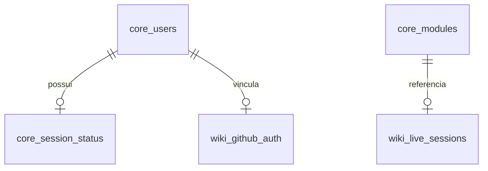

# 🗄️ Modelagem do Banco de Dados (SQLite)

O Portal Crom adota o **SQLite** como motor de banco de dados, centralizado no arquivo `data/core.db`. Para conciliar o isolamento de módulos com a simplicidade e portabilidade de um arquivo local, o banco foi desenhado usando **prefixação rígida** para cada componente do sistema.

---

## ⚡ Otimização de Concorrência (Modo WAL)

Como o sistema lida com módulos de interação frequente (ex: logs de atividade, chat e sessões online), o banco opera obrigatoriamente no modo **WAL (Write-Ahead Logging)**. Isso permite que múltiplos processos realizem operações de leitura e escrita concorrentemente, evitando os tradicionais travamentos do SQLite (`database is locked`).

### Configurações de Conexão no Yii2 (`config/db.php`):
```php
'on afterOpen' => function($event) {
    // Ativa o diário de escrita em segundo plano (WAL)
    $event->sender->createCommand("PRAGMA journal_mode=WAL;")->execute();
    // Tempo máximo (5000ms) que uma requisição aguardará se outra transação estiver escrevendo
    $event->sender->createCommand("PRAGMA busy_timeout=5000;")->execute();
},
```

---

## 🏛️ Esquema de Tabelas do Core (`core_`)

O Core gerencia as tabelas fundamentais de controle de acesso, carregamento de módulos e status de conectividade global.



### 1. Tabela `core_users`
Armazena as credenciais seguras dos membros da Crom e tokens de acesso CLI.

| Campo | Tipo | Restrições | Descrição |
| :--- | :--- | :--- | :--- |
| `id` | `INTEGER` | `PRIMARY KEY AUTOINCREMENT` | ID numérico sequencial do usuário. |
| `username` | `VARCHAR(255)` | `NOT NULL UNIQUE` | Nome de usuário exclusivo para login. |
| `password_hash` | `VARCHAR(255)` | `NOT NULL` | Hash seguro (Blowfish/Bcrypt) da senha. |
| `access_token` | `VARCHAR(255)` | `UNIQUE` | Token de autenticação rápida de API ou terminal. |
| `created_at` | `INTEGER` | `NOT NULL` | Timestamp UNIX de criação do cadastro. |
| `updated_at` | `INTEGER` | `NOT NULL` | Timestamp UNIX de atualização do cadastro. |

### 2. Tabela `core_modules`
O registro mestre do barramento. Controla quais sub-aplicações estão disponíveis e ativas no sistema.

| Campo | Tipo | Restrições | Descrição |
| :--- | :--- | :--- | :--- |
| `id` | `VARCHAR(64)` | `PRIMARY KEY NOT NULL` | Identificador único (slug) do módulo (ex: `app-wiki`). |
| `name` | `VARCHAR(255)` | `NOT NULL` | Nome legível exibido na interface de tabs. |
| `entry_point` | `VARCHAR(255)` | `NOT NULL` | Rota interna do controlador Yii2 (ex: `wiki/default/index`). |
| `icon` | `TEXT` | `NULL` | Código SVG purificado ou classe CSS do ícone no menu. |
| `sort_order` | `INTEGER` | `DEFAULT 0` | Ordem de exibição dos aplicativos no Dock lateral. |
| `is_active` | `BOOLEAN` | `DEFAULT 1 (TRUE)` | Flag para ativar/desativar dinamicamente o app. |

### 3. Tabela `core_session_status`
Tabela ultraleve atualizada de forma não bloqueante a cada request para listar os membros online em tempo real.

| Campo | Tipo | Restrições | Descrição |
| :--- | :--- | :--- | :--- |
| `user_id` | `INTEGER` | `PRIMARY KEY NOT NULL` | ID do usuário cadastrado (Chave Estrangeira lógica para `core_users.id`). |
| `last_activity` | `INTEGER` | `NOT NULL` | Timestamp UNIX da última interação no portal. |
| `is_online` | `BOOLEAN` | `DEFAULT 1 (TRUE)` | Flag indicando presença ativa no sistema. |

---

## 📖 Esquema de Tabelas do Módulo Wiki (`wiki_`)

Tabelas pertencentes ao módulo `app-wiki` (`modules/wiki`), mantendo o banco de dados isolado e preparado para sincronização com Git/GitHub.

### 1. Tabela `wiki_github_auth`
Guarda as credenciais de autenticação OAuth dos membros para realizar edições e commits no nome do próprio autor diretamente no repositório.

| Campo | Tipo | Restrições | Descrição |
| :--- | :--- | :--- | :--- |
| `user_id` | `INTEGER` | `PRIMARY KEY NOT NULL` | ID do usuário local (Link com `core_users.id`). |
| `gh_user_id` | `INTEGER` | `UNIQUE NOT NULL` | Identificador único numérico gerado pelo GitHub. |
| `gh_username` | `TEXT` | `NOT NULL` | Username público do autor no GitHub (ex: `mrjc01`). |
| `access_token` | `TEXT` | `NOT NULL` | Token OAuth ativo criptografado de forma segura. |
| `refresh_token` | `TEXT` | `NOT NULL` | Token de renovação criptografado de longa duração. |
| `expires_at` | `INTEGER` | `NOT NULL` | Timestamp UNIX de expiração do Token de Acesso. |

### 2. Tabela `wiki_pages_cache`
Funciona como uma camada de leitura rápida (Cache RAG-Ready). Evita que a aplicação faça requisições HTTP na API do GitHub para ler páginas em Markdown, driblando o Rate Limit e garantindo carregamentos de tela sub-milisegundos.

| Campo | Tipo | Restrições | Descrição |
| :--- | :--- | :--- | :--- |
| `path` | `TEXT` | `PRIMARY KEY NOT NULL` | Caminho relativo do arquivo no repositório (ex: `projetos/miniapps.md`). |
| `sha` | `TEXT` | `NOT NULL` | Hash SHA1 do blob do arquivo no GitHub (obrigatório para updates/API). |
| `title` | `TEXT` | `NOT NULL` | Título limpo extraído do primeiro título `# H1` do markdown. |
| `content` | `TEXT` | `NOT NULL` | Conteúdo bruto das linhas em Markdown. |
| `last_synced_at` | `INTEGER` | `NOT NULL` | Timestamp UNIX da última sincronização Git. |

### 3. Tabela `wiki_live_sessions`
Mecanismo de Lock Otimista em nível de banco para controle de sessões simultâneas de edição na interface da Wiki.

| Campo | Tipo | Restrições | Descrição |
| :--- | :--- | :--- | :--- |
| `id` | `TEXT` | `PRIMARY KEY` | Identificador UUID da sessão ativa. |
| `path` | `TEXT` | `NOT NULL` | Caminho do arquivo editado (Chave para `wiki_pages_cache.path`). |
| `user_id` | `INTEGER` | `NOT NULL` | ID do membro ativo ocupando a página. |
| `status` | `TEXT` | `NOT NULL` | Estado do usuário no arquivo: `VIEWING` ou `EDITING`. |
| `updated_at` | `INTEGER` | `NOT NULL` | Heartbeat para expiração automática de sessões inativas (15 segundos). |

---

## 💡 Diretrizes de Integridade de Dados

1. **Chaves Estrangeiras Lógicas:** Para manter os módulos fracamente acoplados, não são aplicadas restrições físicas de `FOREIGN KEY` gerenciadas pelo motor do SQLite entre tabelas de prefixos diferentes. A consistência é garantida inteiramente pela **Camada de Aplicação (ActiveRecord do Yii2)**.
2. **Criptografia de Dados:** Credenciais OAuth (`access_token`, `refresh_token`) contidas na tabela `wiki_github_auth` devem ser salvas criptografadas de ponta a ponta na base de dados utilizando o componente de segurança nativo `Yii::$app->security->encryptByPassword()`.
