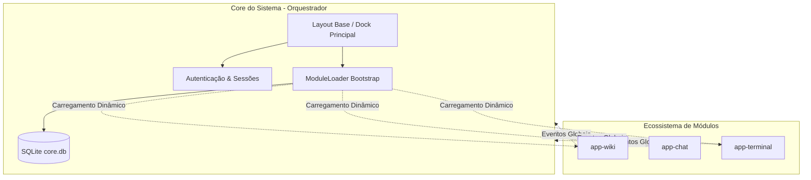

# 🗺️ Portal Crom — Visão Geral e Arquitetura do Sistema

> "Soberania não se pede, constrói-se."

Bem-vindo à documentação oficial do **Portal Crom**, uma solução de intranet, fórum, rede social, wiki interna e barramento de ferramentas (como terminal integrado e chat) projetada sob a arquitetura de **Monólito Modular** (ou *Microkernel*). 

Este sistema foi concebido para evoluir de forma incremental, leve e desacoplada, utilizando **Yii2**, **SQLite** e uma interface reativa moderna construída com **TailwindCSS**, **Alpine.js** e **HTMX**.

---

## 🏛️ Filosofia de Design e Arquitetura

O Portal Crom é projetado como um **Monólito Modular**. Isso significa que todo o sistema reside sob uma mesma aplicação web em Yii2, mas suas áreas de negócio (Wiki, Chat, Terminal) são divididas em **módulos independentes** que não possuem acoplamento físico ou lógico rígido.



### Os 3 Pilares do Core
1. **O Orquestrador (Barramento):** O Core do sistema não executa regras de negócio dos módulos. Ele gerencia o ciclo de vida dos módulos através do componente personalizado `ModuleLoader` no Bootstrap do Yii2.
2. **Isolamento de Banco de Dados:** Embora centralizados em um banco SQLite (`core.db`), os dados usam prefixação estrita por módulo (ex: `core_` para o Core, `wiki_` para o módulo Wiki), permitindo fácil migração para basesSQLite separadas ou bancos clássicos (PostgreSQL/MySQL) no futuro.
3. **Comunicação Orientada a Eventos:** Módulos não conhecem a implementação uns dos outros. Quando o módulo A precisa notificar algo (ex: usuário logou), ele dispara um evento global no Yii2 (`Yii::$app->trigger()`) que é escutado de forma assíncrona/reativa por outros módulos interessados.

---

## 📂 Organização Física de Diretórios

A estrutura física do repositório foi planejada para refletir esse isolamento:

```text
app_web/
├── components/          # Componentes globais do Core (ex: ModuleLoader.php)
├── config/              # Arquivos de configuração globais (web.php, db.php)
├── data/                # Banco de dados SQLite (core.db)
├── docs/                # Esta documentação técnica (.md)
├── migrations/          # Migrações globais de banco de dados do Core
├── modules/             # Ecossistema de aplicativos modulares
│   └── wiki/            # Módulo app-wiki (Wiki GitOps)
│       ├── controllers/
│       ├── migrations/  # Migrações específicas da Wiki
│       ├── models/
│       └── views/
├── web/                 # Recursos públicos (assets, index.php)
└── yii                  # CLI de gerenciamento do Yii2
```

---

## 📖 Mapa de Navegação da Documentação

Para compreender profundamente cada aspecto técnico do sistema, consulte os seguintes documentos:

1. **[Arquitetura e Inicialização](arquitetura.md):** Detalha o funcionamento do `ModuleLoader`, o Bootstrap dinâmico do Yii2 e a comunicação via barramento de eventos globais.
2. **[Modelagem do Banco de Dados](banco-de-dados.md):** Descreve detalhadamente o esquema das tabelas SQLite (`core_` e `wiki_`) e as diretivas de otimização de concorrência com o modo **WAL**.
3. **[Layout Estilo SPA e Tabs](layout-tabs.md):** O design de abas similar a um navegador usando TailwindCSS, controle de estado reativo com Alpine.js e injeções de HTML puro via HTMX.
4. **[Módulo Wiki GitOps](modulo-wiki.md):** A arquitetura do `app-wiki` integrado com tokens de acesso OAuth do GitHub, Locks de edição concorrente e escala futura para WebSocket em Go.
5. **[Roteiro de Desenvolvimento](roteiro-desenvolvimento.md):** Cronograma de desenvolvimento incremental em fases para implementação e evolução contínua da plataforma.
