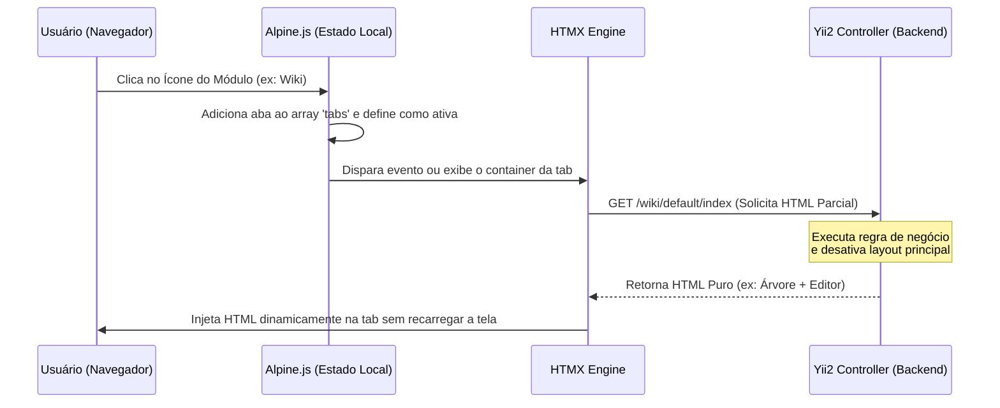

# 🖥️ Interface Estilo Navegador (Abas Reativas)

Para entregar a fluidez visual de uma **Single Page Application (SPA)** sem a complexidade, peso e tempo de compilação de frameworks modernos (como React, Vue ou Angular), o Portal Crom utiliza uma stack extremamente leve e poderosa: **TailwindCSS + Alpine.js + HTMX**.



---

## 🏛️ A Casca Base (`layouts/main.php`)

O arquivo de layout principal do Yii2 serve apenas como o contêiner estrutural global (a "casca"). Ele define a barra lateral (Dock) e o gerenciador de abas gerenciado reativamente pelo Alpine.js.

### Estrutura de Estado do Alpine.js (`x-data`)
No contêiner principal, o Alpine.js gerencia um estado simples e reativo:
- `tabs`: Um array de objetos representando as abas abertas. Cada objeto possui `id` (slug do módulo), `name` (título legível) e `url` (endpoint de carregamento).
- `activeTab`: O ID da aba que está atualmente focada e visível na tela.

### Exemplo Base do Layout Estrutural:
```html
<div class="flex h-screen w-screen bg-slate-950 text-slate-100 overflow-hidden" 
     x-data="{ tabs: [], activeTab: null, openTab(id, name, url) {
         if (!this.tabs.some(t => t.id === id)) {
             this.tabs.push({ id, name, url });
         }
         this.activeTab = id;
     }, closeTab(id) {
         this.tabs = this.tabs.filter(t => t.id !== id);
         if (this.activeTab === id) {
             this.activeTab = this.tabs.length ? this.tabs[this.tabs.length - 1].id : null;
         }
     }}">

    <!-- 1. DOCK / BARRA LATERAL FIXA -->
    <aside class="w-16 md:w-20 bg-slate-900 border-r border-slate-800 flex flex-col items-center py-6 justify-between flex-shrink-0">
        <div class="flex flex-col items-center gap-6 w-full">
            <!-- Logo Crom -->
            <div class="w-10 h-10 bg-sky-500/10 text-sky-400 rounded-xl flex items-center justify-center font-bold text-lg border border-sky-500/20">
                Ω
            </div>
            
            <!-- Menu de Módulos (Carregados do SQLite) -->
            <nav class="flex flex-col gap-3 w-full px-2">
                <!-- Iteração sobre os módulos ativos no banco de dados -->
                <button @click="openTab('app-wiki', 'Wiki Interna', '/wiki/default/index')"
                        class="w-full aspect-square rounded-xl flex items-center justify-center text-slate-400 hover:text-sky-400 hover:bg-slate-800/50 transition-all duration-200"
                        :class="activeTab === 'app-wiki' ? 'bg-sky-500/10 text-sky-400 border border-sky-500/20' : ''"
                        title="Wiki Interna">
                    <!-- SVG do ícone extraído do core_modules -->
                    <svg class="w-6 h-6" ...></svg>
                </button>
            </nav>
        </div>
        
        <!-- Perfil do Usuário / Status Online -->
        <div class="flex flex-col items-center gap-4">
            <div class="relative">
                <span class="absolute bottom-0 right-0 w-3 h-3 bg-emerald-500 border-2 border-slate-900 rounded-full"></span>
                <div class="w-8 h-8 rounded-full bg-slate-700 flex items-center justify-center text-xs font-bold text-slate-300">
                    AD
                </div>
            </div>
        </div>
    </aside>

    <!-- 2. CONTAINER DE CONTEÚDO PRINCIPAL (TABS NAVEGADOR) -->
    <main class="flex-1 flex flex-col min-w-0 overflow-hidden">
        
        <!-- Barra de Cabeçalho / Abas Abertas -->
        <header class="h-12 bg-slate-900 border-b border-slate-800 flex items-center px-4 overflow-x-auto scrollbar-none flex-shrink-0">
            <div class="flex items-center gap-1">
                <!-- Tab Principal (Dashboard/Home) -->
                <div @click="activeTab = null"
                     class="flex items-center gap-2 px-3 py-1.5 rounded-lg text-xs font-medium cursor-pointer transition"
                     :class="activeTab === null ? 'bg-slate-800 text-slate-100 font-bold' : 'text-slate-400 hover:text-slate-200'">
                    🏠 Dashboard
                </div>

                <!-- Abas Dinâmicas de Módulos -->
                <template x-for="tab in tabs" :key="tab.id">
                    <div class="flex items-center gap-2 px-3 py-1.5 rounded-lg text-xs font-medium cursor-pointer transition border border-transparent"
                         :class="activeTab === tab.id ? 'bg-slate-800 text-sky-400 font-bold border-slate-700' : 'text-slate-400 hover:text-slate-200 hover:bg-slate-800/30'"
                         @click="activeTab = tab.id">
                        <span x-text="tab.name"></span>
                        <button class="hover:bg-slate-700 text-slate-500 hover:text-rose-400 rounded-full p-0.5" 
                                @click.stop="closeTab(tab.id)">
                            ✕
                        </button>
                    </div>
                </template>
            </div>
        </header>

        <!-- Área de Exibição do Conteúdo -->
        <section class="flex-1 min-h-0 overflow-y-auto bg-slate-950 relative">
            <!-- Dashboard Principal (Visível quando activeTab === null) -->
            <div class="h-full w-full p-6" x-show="activeTab === null">
                <h1 class="text-2xl font-bold text-slate-100 mb-2">Bem-vindo, Membro CROM</h1>
                <!-- Widget de usuários online -->
                ...
            </div>

            <!-- Contêineres Dinâmicos das Tabs -->
            <template x-for="tab in tabs" :key="tab.id">
                <div class="h-full w-full absolute inset-0" 
                     x-show="activeTab === tab.id"
                     :id="'container-' + tab.id">
                     <!-- Injeção Assíncrona via HTMX quando renderizada -->
                     <div :hx-get="tab.url"
                          hx-trigger="intersect once"
                          hx-swap="outerHTML"
                          class="flex items-center justify-center h-full text-slate-500 text-sm">
                          <span class="animate-pulse">Carregando aplicação...</span>
                     </div>
                </div>
            </template>
        </section>
    </main>
</div>
```

---

## 🔌 Contrato de Integração dos Módulos

Para que a injeção assíncrona do HTMX funcione de forma limpa sem quebrar a interface nem duplicar componentes globais do HTML, os controladores de cada módulo devem seguir estritamente as diretivas abaixo:

1. **Desativação de Layout Global:**
   O método `actionIndex()` (ou qualquer rota chamada pelas tabs) deve desativar o layout mestre do Yii2 e retornar apenas o HTML parcial estilizado.
   ```php
   namespace app\modules\wiki\controllers;
   use yii\web\Controller;

   class DefaultController extends Controller
   {
       public function init()
       {
           parent::init();
           // Desativa o layout principal do Yii2 para retornar apenas conteúdo puro
           $this->layout = false;
       }

       public function actionIndex()
       {
           // Retorna a view parcial
           return $this->render('index');
       }
   }
   ```

2. **TailwindCSS Isolado:**
   As views dos módulos devem utilizar classes Tailwind padrões. Como o Tailwind carrega globalmente na "casca" (`main.php`), qualquer classe usada nos fragmentos HTML injetados pelo HTMX será renderizada instantaneamente pelo navegador.

3. **Alpine.js Aninhado:**
   Caso a interface de um módulo exija comportamento interno (ex: abrir o editor, expandir árvores de diretórios), o fragmento HTML injetado deve declarar seu próprio escopo `x-data`. O Alpine.js detecta novas injeções na árvore DOM e inicializa o componente local instantaneamente de forma autônoma.
