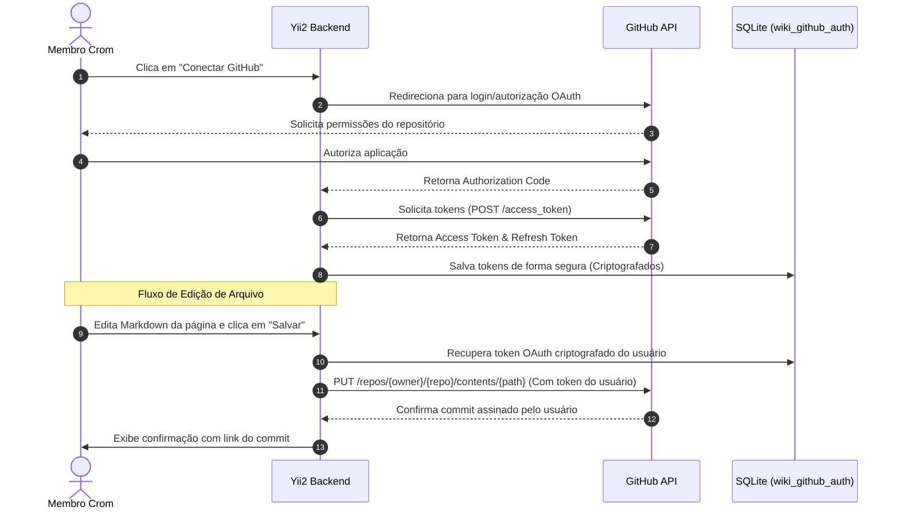
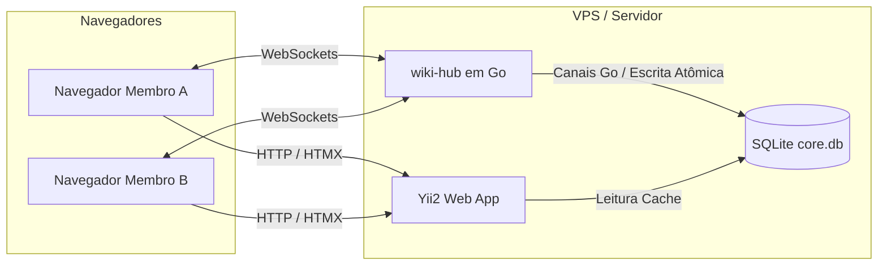

# 📖 Módulo app-wiki (GitOps Web Engine)

O módulo **app-wiki** (`modules/wiki`) é uma das partes mais sofisticadas do Portal Crom. Ele foi desenhado para atuar como uma **interface visual GitOps** sobre o repositório Git oficial da Wiki da comunidade, permitindo leitura veloz e escritas descentralizadas diretamente assinadas por cada membro via API oficial do GitHub.

---

## ⚡ Fluxo de Escrita Seguro (GitOps OAuth)

Em vez de clonar o repositório inteiro na máquina de cada usuário ou utilizar credenciais compartilhadas do servidor (o que eliminaria a rastreabilidade de autoria), a Wiki opera por meio de **Tokens Pessoais OAuth** obtidos de forma integrada com um GitHub App.



### Segurança na Persistência dos Tokens
Os tokens de acesso são mantidos na tabela `wiki_github_auth` e sempre criptografados na gravação usando a biblioteca de segurança do Yii2:
```php
// Salvando o Token Criptografado
$encryptedToken = Yii::$app->security->encryptByPassword($tokenFromGithub, $envSecretKey);

// Descriptografando para chamadas de API
$decryptedToken = Yii::$app->security->decryptByPassword($encryptedTokenFromDb, $envSecretKey);
```

---

## 🔒 Mecanismo Anti-Conflito (Locks Otimistas)

Para evitar que dois membros editem o mesmo arquivo Markdown ao mesmo tempo e gerem conflitos de merge difíceis de resolver automaticamente, o sistema implementa um **Mecanismo de Lock por Polling** usando **HTMX Polling** contra a tabela `wiki_live_sessions`.

### Funcionamento do Lock:
1. Quando o usuário X abre um arquivo na tela e clica em **"Editar Página"**, o backend faz um `INSERT` ou `UPDATE` na tabela `wiki_live_sessions` marcando o status como `EDITING`.
2. A tela dos outros usuários que possuem o mesmo arquivo aberto em modo de visualização faz consultas automáticas a cada 5 segundos usando HTMX:
   ```html
   <div hx-get="/wiki/default/lock-status?path=projetos/miniapps.md" 
        hx-trigger="every 5s" 
        hx-swap="innerHTML">
        <!-- O backend injeta o status do lock aqui -->
   </div>
   ```
3. Se o backend detectar que o usuário X está editando, ele retorna um HTML avisando: **"🟢 pedrodev está editando este arquivo neste momento"** e o HTMX desabilita o botão "Editar Página" para os demais membros.
4. O lock tem um tempo de expiração de **15 segundos** (atualizado via Heartbeat a cada consulta do usuário que está editando). Se o usuário X fechar a aba ou ficar ocioso, o lock expira sozinho, liberando a edição para outros.

---

## 🔮 Futuro Assíncrono (Live Collaborative)

Para escalar a Wiki para um editor de texto colaborativo assíncrono em tempo real de nível profissional, a arquitetura prevê a integração de um microsserviço independente escrito em **Go** (chamado `wiki-hub`).



### O Hub Go (`wiki-hub`):
- **Desempenho Extremo:** Escrito em Go para gerenciar milhares de conexões persistentes **WebSocket** concorrentes com consumo mínimo de memória.
- **Transmissão de Eventos:** Transmite cursores em tempo real, digitação parcial (*keystrokes*) e avisos de presença de forma instantânea para todos os navegadores conectados na mesma página.
- **Sincronização Atômica:** O hub Go realiza a escrita das alterações de forma rápida e segura no banco SQLite centralizado antes de delegar os disparos de commits assíncronos.

---

## 📐 Wireframe e Layout da Interface (Pronto para Injeção HTMX)

O fragmento de HTML abaixo descreve a interface em painel duplo (Split Pane) construída com TailwindCSS e Alpine.js, pronta para ser retornada sem layouts pelo backend do Yii2:

```html
<div class="flex h-full w-full bg-slate-950 text-slate-100" x-data="{ editing: false, activeFile: '' }">
    
    <!-- Árvore de Diretórios (Esquerda: 25%) -->
    <div class="w-1/4 border-r border-slate-800 bg-slate-900/50 p-4 flex flex-col justify-between">
        <div>
            <div class="text-xs font-semibold text-slate-400 uppercase tracking-wider mb-3">Diretório da Wiki</div>
            <ul class="space-y-1 text-sm text-slate-300">
                <li><span class="cursor-pointer hover:text-sky-400 block p-1">📁 membros/</span></li>
                <li><span class="cursor-pointer hover:text-sky-400 block p-1">📁 governanca/</span></li>
                <li>
                    <span class="cursor-pointer hover:text-sky-400 block p-1" 
                          @click="activeFile = 'projetos/miniapps.md'; editing = false"
                          :class="activeFile === 'projetos/miniapps.md' ? 'text-sky-400 font-medium' : ''">
                        📂 projetos/
                    </span>
                    <ul class="pl-4 border-l border-slate-800 ml-2 space-y-0.5 mt-1 text-xs text-slate-400">
                        <li class="hover:text-slate-200 cursor-pointer p-0.5">📄 miniapps.md</li>
                        <li class="hover:text-slate-200 cursor-pointer p-0.5">📄 crompressor.md</li>
                    </ul>
                </li>
                <li><span class="cursor-pointer hover:text-sky-400 block p-1">📁 infra/</span></li>
            </ul>
        </div>

        <div class="pt-4 border-t border-slate-800">
            <button hx-post="/wiki/default/sync" 
                    hx-swap="none"
                    class="w-full bg-slate-800 hover:bg-slate-700 text-slate-300 text-xs py-2 px-3 rounded transition flex items-center justify-center gap-2">
                🔄 Atualizar Base (Git Pull Cache)
            </button>
        </div>
    </div>

    <!-- Editor / Visualizador (Direita: 75%) -->
    <div class="w-3/4 flex flex-col h-full bg-slate-950 p-6">
        <template x-if="!activeFile">
            <div class="flex-1 flex flex-col items-center justify-center text-slate-500">
                <span class="text-4xl mb-2">📖</span>
                <p class="text-sm">Selecione um arquivo markdown na árvore lateral para visualizar ou editar.</p>
            </div>
        </template>

        <template x-if="activeFile">
            <div class="flex-1 flex flex-col h-full">
                <div class="flex justify-between items-center pb-4 border-b border-slate-800 mb-4">
                    <div>
                        <h3 class="text-lg font-bold text-slate-200" x-text="activeFile"></h3>
                        <div class="text-xs text-emerald-400 flex items-center gap-1 mt-1">
                            <span class="inline-block w-2 h-2 rounded-full bg-emerald-500 animate-pulse"></span>
                            <span class="font-mono">pedrodev</span> está visualizando este arquivo agora.
                        </div>
                    </div>
                    <div>
                        <button @click="editing = !editing" 
                                class="bg-sky-600 hover:bg-sky-500 text-white text-xs py-1.5 px-4 rounded font-medium shadow-sm"
                                x-text="editing ? '👁️ Modo Visualização' : '📝 Editar Página'">
                        </button>
                    </div>
                </div>

                <div class="flex-1 bg-slate-900/30 rounded border border-slate-800/60 p-4 font-mono text-sm overflow-y-auto">
                    <form x-show="editing" hx-post="/wiki/default/save" hx-swap="none" class="h-full flex flex-col justify-between">
                        <input type="hidden" name="filepath" :value="activeFile">
                        <textarea name="markdown_content" 
                                  class="w-full flex-1 bg-slate-900 border border-slate-700 rounded p-3 text-slate-100 focus:outline-none focus:border-sky-500 font-mono text-sm resize-none h-[400px]"
                                  placeholder="# Digite seu Markdown aqui..."></textarea>
                        
                        <div class="mt-4 flex justify-end gap-2">
                            <button type="button" @click="editing = false" class="bg-slate-800 hover:bg-slate-700 text-slate-300 text-xs py-2 px-4 rounded">Cancelar</button>
                            <button type="submit" class="bg-emerald-600 hover:bg-emerald-500 text-white text-xs py-2 px-4 rounded font-bold">🚀 Comitar Alterações no GitHub</button>
                        </div>
                    </form>

                    <div x-show="!editing" class="prose prose-invert max-w-none text-slate-300">
                        <h1 class="text-2xl font-bold text-slate-100 mb-2"># ⚙️ MiniApps</h1>
                        <p class="text-slate-400 mb-4">Plataforma de micro-aplicações da comunidade baseada em BCoins.</p>
                        <div class="bg-slate-900 p-3 rounded text-xs text-sky-400 border border-slate-800">
                            // Código ou notas técnicas da especificação do ecossistema.
                        </div>
                    </div>
                </div>
            </div>
        </template>
    </div>
</div>
```
